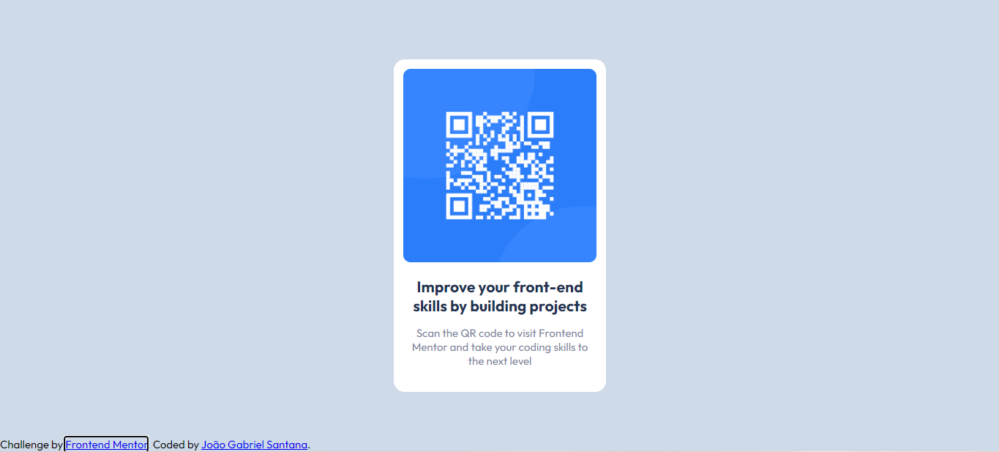

# Frontend Mentor - QR code component solution

This is a solution to the [QR code component challenge on Frontend Mentor](https://www.frontendmentor.io/challenges/qr-code-component-iux_sIO_H). Frontend Mentor challenges help you improve your coding skills by building realistic projects. 

## Table of contents

- [Overview](#overview)
  - [Screenshot](#screenshot)
  - [Links](#links)
- [My process](#my-process)
  - [Built with](#built-with)
  - [What I learned](#what-i-learned)
  - [Continued development](#continued-development)
  - [Useful resources](#useful-resources)
- [Author](#author)
- [Acknowledgments](#acknowledgments)

**Note: Delete this note and update the table of contents based on what sections you keep.**

## Overview

### Screenshot



### Links

- Solution URL: [Add solution URL here](https://your-solution-url.com)
- Live Site URL: [Add live site URL here](https://your-live-site-url.com)

## My process

### Built with

- HTML5 
- CSS 
- Flexbox

### What I learned

To see how you can add code snippets, see below:


```css
:root{
    font-family: "Outfit";
    font-size: 15px;
}s
```

### Useful resources

- [Mozilla](https://developer.mozilla.org/pt-BR/docs/Web/CSS/:root) - This helped me to use the paragraph font size as the root font size.

## Author

- Frontend Mentor - [Jao16905](https://www.frontendmentor.io/profile/Jao16905)
**Note: Delete this note and add/remove/edit lines above based on what links you'd like to share.**
